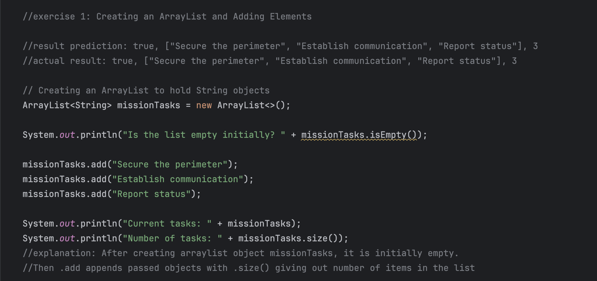
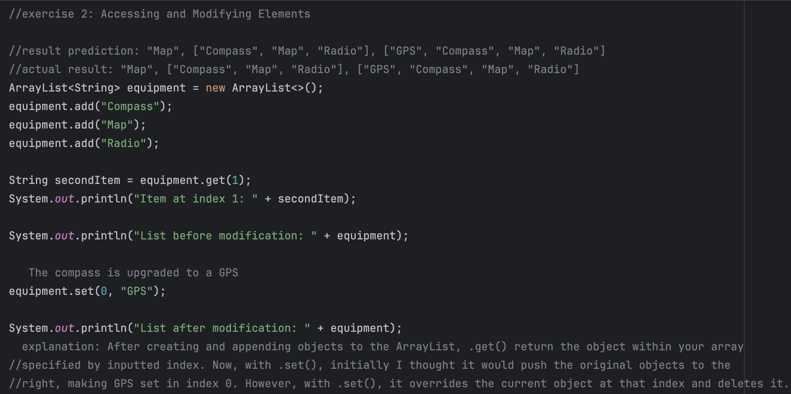
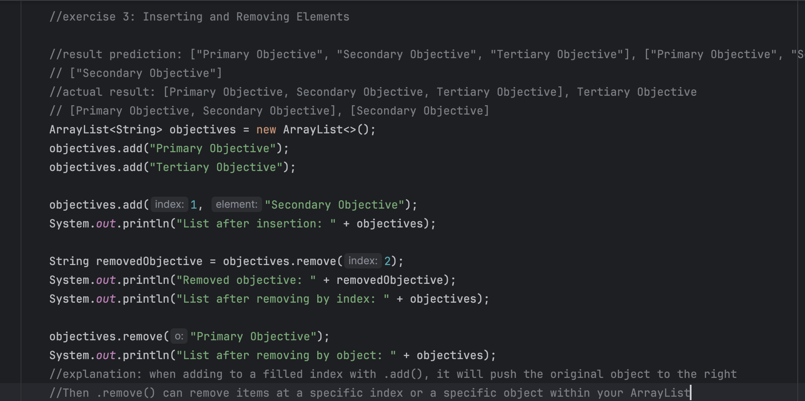
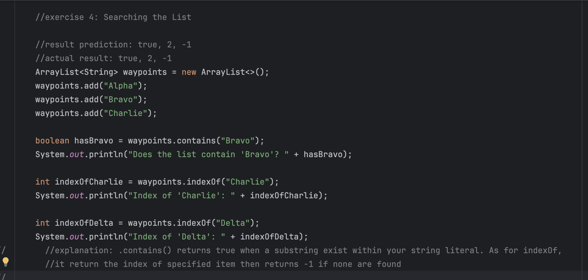
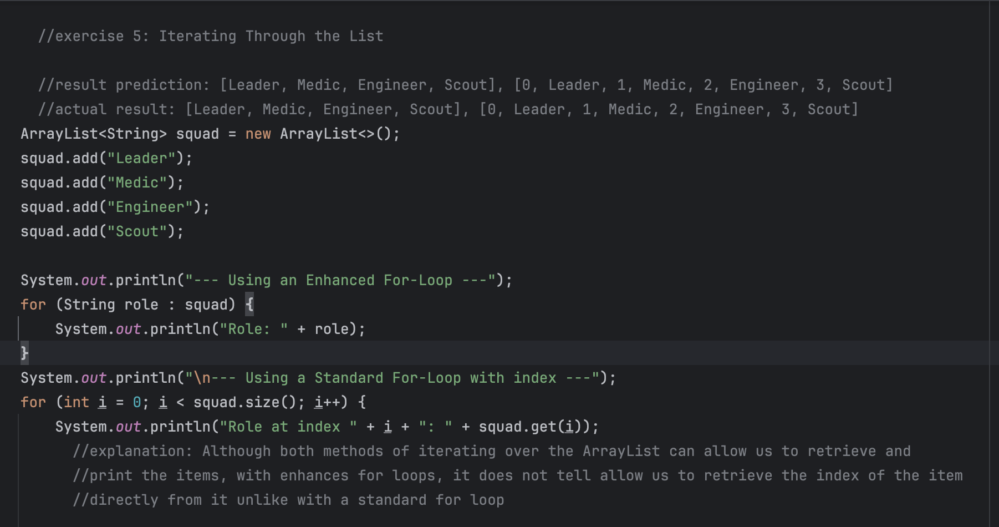
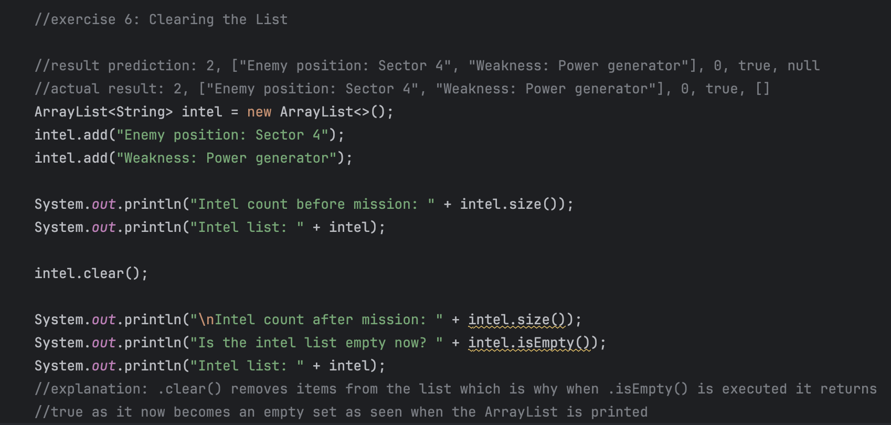

# Lab: Exploring Java ArrayList

### by: Ivan Patrick Frondozo

## Description:
 This Java program explores the foundational methods and use-cases of ArrayLists through different exercises created within the program.

## Output:

### Lab 1: Creating an ArrayList and Adding Elements

### Lab 2: Accessing and Modifying Elements

### Lab 3: Inserting and Removing Elements

### Lab 4: Searching the List

### Lab 5: Iterating Through the List

### Lab 6: Clearing the List

